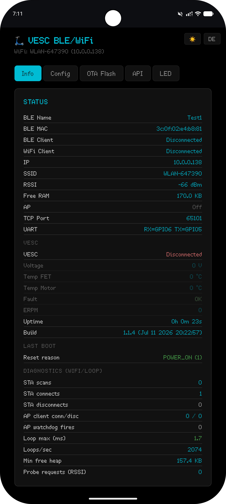
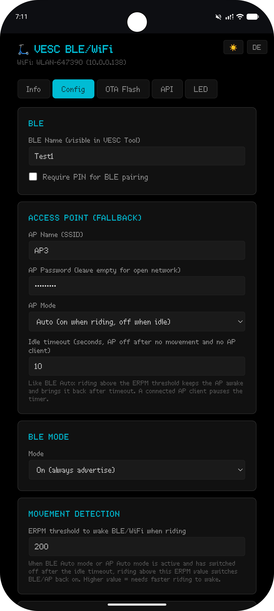
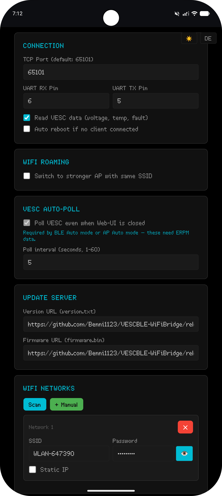
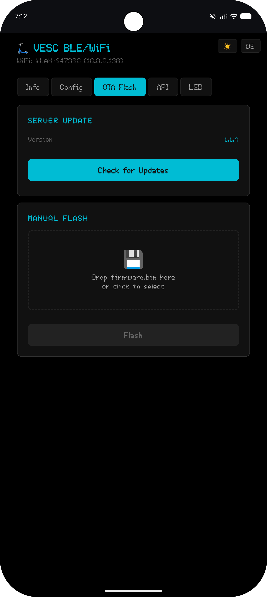
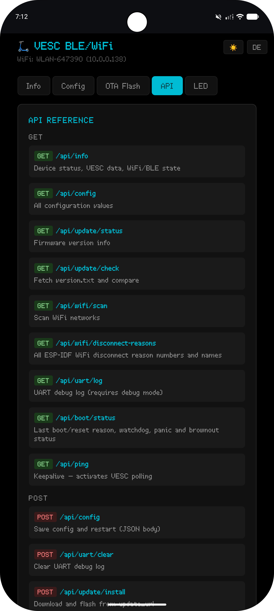
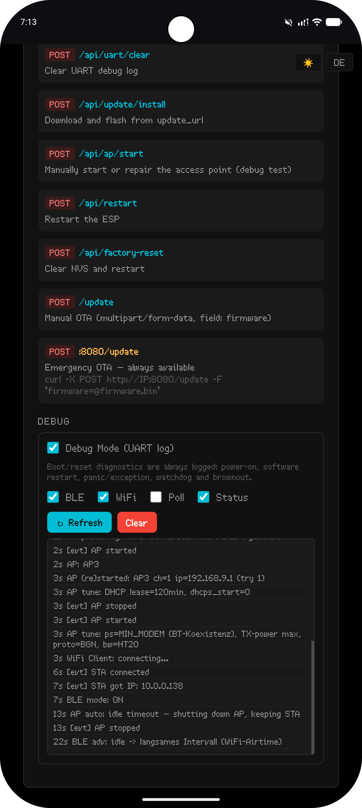
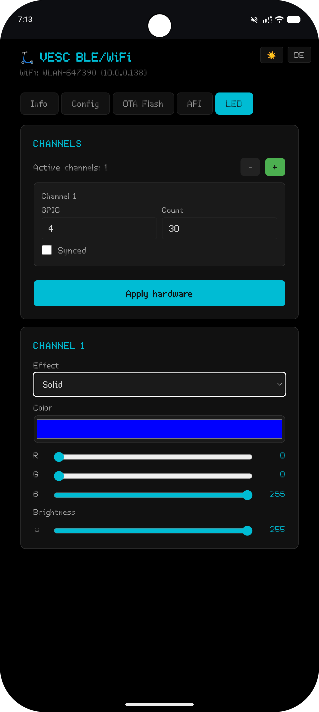

# VESC BLE/WiFi Bridge for ESP32-S3

<p align="center">
  <strong>Connect a VESC to VESC Tool over Bluetooth LE or WiFi/TCP using an ESP32-S3.</strong>
</p>

<p align="center">
  
  
  
  <a href="https://github.com/Benni1123/VESCBLE-WiFiBridge/releases/latest"></a>
</p>

## Overview

VESC BLE/WiFi Bridge is firmware for an **ESP32-S3** that connects directly to the UART port of a VESC motor controller and makes the connection available through:

- Bluetooth Low Energy for VESC Tool
- WiFi/TCP, default port `65101`
- A responsive browser-based configuration and diagnostic interface
- A JSON REST API for status, configuration, updates and debugging

The bridge can operate as a WiFi station and as its own fallback access point at the same time. It also includes automatic reconnect, roaming, access-point recovery, OTA updates, boot/reset diagnostics and optional multi-channel WS28xx LED control.

> [!IMPORTANT]
> This project targets the **ESP32-S3**. It is not intended for the ESP32-C3.

---

## Screenshots

The web interface is shown below using the screenshots stored in `docs/screenshots/`.

### Live status

<p align="center">
  
</p>

<p align="center">
  <strong>Live bridge, WiFi, Bluetooth LE and VESC information</strong>
</p>

### Configuration

<table>
  <tr>
    <td width="50%" align="center" valign="top">
      <br>
      <strong>General, BLE and access-point settings</strong>
    </td>
    <td width="50%" align="center" valign="top">
      <br>
      <strong>WiFi networks, roaming and advanced settings</strong>
    </td>
  </tr>
</table>

### OTA updates

<p align="center">
  
</p>

<p align="center">
  <strong>Server update check and manual firmware upload</strong>
</p>

### API and debug log

<table>
  <tr>
    <td width="50%" align="center" valign="top">
      <br>
      <strong>REST API reference and bridge endpoints</strong>
    </td>
    <td width="50%" align="center" valign="top">
      <br>
      <strong>UART, WiFi, BLE and boot diagnostic log</strong>
    </td>
  </tr>
</table>

### LED control

<p align="center">
  
</p>

<p align="center">
  <strong>Multi-channel WS28xx configuration and effects</strong>
</p>

The screenshot filenames are case-sensitive. The repository layout should be:

```text
docs/
└── screenshots/
    ├── info.png
    ├── config1.png
    ├── config2.png
    ├── ota.png
    ├── api1.png
    ├── api2.png
    └── led.png
```

---

## Main features

### VESC connectivity

- Bidirectional VESC UART bridge
- Bluetooth LE connection for VESC Tool
- WiFi/TCP connection for VESC Tool
- Configurable UART RX and TX pins
- Configurable TCP port
- Optional background VESC polling
- Live VESC values:
  - Input voltage
  - FET temperature
  - Motor temperature
  - Fault code and fault name
  - ERPM

### Bluetooth Low Energy

- Configurable BLE device name
- On, Off and Auto modes
- Automatic wake-up based on VESC ERPM
- Configurable idle timeout
- Optional six-digit BLE pairing PIN
- Just Works pairing when PIN protection is disabled
- Dynamic MTU handling

### WiFi and fallback access point

- Up to 10 saved WiFi networks
- DHCP or static IP configuration per network
- Configurable hostname
- Automatic reconnect with asynchronous network scanning
- Exponential scan backoff when no known network is available
- RSSI-based roaming between access points using the same SSID
- Integrated fallback access point and captive portal
- AP Always On and Auto modes
- Automatic AP wake-up based on ERPM
- AP health watchdog and automatic repair
- Manual AP start endpoint for diagnostic tests
- AP configuration is applied before the first beacon to avoid a temporary `ESP_XXXX` network
- Fixed fallback AP address: `192.168.9.1/24`
- Public DNS fallback if the configured DNS server is unavailable

### Web interface

- Responsive desktop and mobile UI
- Automatic dark/light theme detection
- Manual theme switch
- English and German language support
- Live bridge, BLE, WiFi and VESC status
- Full configuration page
- OTA update page
- Built-in API reference
- Browser-based UART and event debug log
- Optional LED control page

### OTA and recovery

- Check the update server for a newer version
- Install firmware directly from the configured update URL
- Manual `firmware.bin` upload through the web interface
- Emergency OTA server on port `8080`
- Configurable firmware and version URLs
- LEDs are switched off before reboot or OTA to prevent frozen output states

### Diagnostics

- Persistent boot/reset diagnostics in the web UI and API
- Power-on reset detection
- Planned software restart reason
- Panic, exception and `abort()` detection
- Interrupt watchdog detection
- Task watchdog detection
- Other watchdog reset detection
- Brownout detection for power-supply voltage drops
- External reset and deep-sleep wake-up detection
- WiFi event logging
- Numeric and human-readable WiFi disconnect reasons
- Loop timing, heap minimum, scan, reconnect and AP watchdog counters
- Debug filters for BLE, WiFi, polling and general status messages

### Optional WS28xx LEDs

- Up to four independently configurable LED channels
- Optional channel synchronization
- Configurable pin, LED count, brightness, speed and width
- Effects:
  - Solid color
  - Knight Rider scanner
  - Police EU
  - Police US with white center
  - Police US wig-wag
  - Rainbow
  - Breathing
  - Sparkle
  - Meteor
  - Fire

> [!WARNING]
> Police-style lighting may be restricted or illegal on public roads. Use these effects only where legally permitted.

---

## Hardware

### Required hardware

- ESP32-S3 development board
- VESC-compatible motor controller with UART
- Stable regulated power supply for the ESP32-S3
- Common ground between the ESP32-S3 and VESC

### Default UART wiring

The pins can be changed later in the web interface.

| ESP32-S3 | Direction | VESC |
|---|---:|---|
| GPIO 6 (`RX`) | ← | TX |
| GPIO 5 (`TX`) | → | RX |
| GND | ↔ | GND |

> [!CAUTION]
> Use only logic-level UART signals suitable for the ESP32-S3. Never connect the scooter traction-battery voltage directly to the ESP32-S3. Use a properly rated DC/DC converter and verify the output voltage before connecting the board.

### Optional LED wiring

WS2812B, WS2815 and similar 800 kHz WS28xx strips can be configured in the LED page. Use an appropriate external power supply, connect all grounds together and add level shifting when required by the strip or cable length.

---

## Installing the firmware

### Method 1: First installation with ESPHome Web

The complete firmware image can be flashed directly to the ESP32-S3 using **ESPHome Web**.

1. Download `firmware-full.bin` from the latest GitHub release.
2. Open [ESPHome Web](https://web.esphome.io/) in a browser with Web Serial support.
3. Connect the ESP32-S3 to the computer by USB.
4. Click **Connect** and select the ESP32-S3 serial device.
5. Choose **Install**.
6. Select the downloaded `firmware-full.bin` file.
7. Wait until flashing is complete, then restart the board.

Latest release:

```text
https://github.com/Benni1123/VESCBLE-WiFiBridge/releases/latest
```

Direct full-firmware download:

```text
https://github.com/Benni1123/VESCBLE-WiFiBridge/releases/latest/download/firmware-full.bin
```

Use `firmware-full.bin` for a clean first installation or full recovery. For normal OTA updates after installation, use `firmware.bin`.

### Method 2: Build and upload with PlatformIO

1. Install Visual Studio Code.
2. Install the PlatformIO extension.
3. Clone or download this repository.
4. Open the project directory in PlatformIO.
5. Select an **ESP32-S3** board configuration matching your hardware.
6. Build and upload the project.

Required libraries include:

- Arduino framework for ESP32
- NimBLE-Arduino
- Adafruit NeoPixel

The project uses a Unity-style source layout. `main.cpp` includes the individual module `.cpp` files while each module remains separated for easier maintenance. Keep the project files together in the `src` directory unless the build configuration explicitly provides matching include paths.

---

## First startup

After a first installation or factory reset, the bridge creates its fallback access point.

| Setting | Default value |
|---|---|
| AP SSID | `VESC-BLE-WiFi` |
| AP password | Open network |
| AP address | `192.168.9.1` |
| BLE name | `VESC-BLE-WiFi` |
| Hostname | `vesc-ble-wifi` |
| TCP port | `65101` |
| UART RX | GPIO 6 |
| UART TX | GPIO 5 |

1. Connect a phone or computer to the `VESC-BLE-WiFi` network.
2. The captive portal should open automatically.
3. If it does not open, browse to:

```text
http://192.168.9.1/
```

4. Open the **Config** tab.
5. Add one or more WiFi networks.
6. Set an AP password if the fallback access point should not remain open.
7. Configure UART pins, TCP port, BLE mode and optional update URLs.
8. Save the configuration. The ESP32-S3 restarts automatically.

The access point is forced on while the device has never been configured, ensuring that the web interface remains reachable after a factory reset.

---

## Connecting with VESC Tool

### Bluetooth Low Energy

1. Enable Bluetooth on the phone or computer.
2. Open VESC Tool.
3. Search for BLE devices.
4. Select the configured bridge name, default `VESC-BLE-WiFi`.
5. Enter the configured six-digit pairing PIN when PIN pairing is enabled.

### WiFi/TCP

1. Make sure the client device can reach the ESP32-S3 through the fallback AP or the normal LAN.
2. In VESC Tool, create a TCP connection.
3. Enter the bridge IP address.
4. Use TCP port `65101`, unless it was changed in the configuration.

Example:

```text
Host: 10.0.0.210
Port: 65101
```

---

## Web interface

The main web interface is available on port `80`:

```text
http://<bridge-ip>/
```

### Info tab

Displays:

- BLE name, MAC address and client state
- WiFi and AP state
- IP address, SSID and RSSI
- Free memory and uptime
- VESC voltage, temperatures, fault and ERPM
- Firmware version
- Last reset reason
- Diagnostic counters

### Config tab

Provides settings for:

- BLE name, mode and pairing PIN
- Access-point SSID, password and mode
- Movement/ERPM threshold
- Saved WiFi networks
- Static IP configuration
- TCP port
- UART pins
- VESC polling
- Automatic restart
- WiFi roaming
- OTA URLs
- Debug log size and filters
- Optional LED control

### OTA Flash tab

Provides:

- Current firmware version
- Update-server check
- Server-based OTA installation
- Manual drag-and-drop firmware upload

### API tab

Contains the live API reference and browser-based debug log.

### LED page

Available at `/leds` when LED control is enabled.

---

## Firmware updates

### Update from the web interface

Open:

```text
http://<bridge-ip>/?tab=ota
```

Use either:

- **Check for Updates** and server installation
- Manual upload of `firmware.bin`

### Normal OTA with curl

```bash
curl -X POST "http://<bridge-ip>/update" \
  -F "firmware=@firmware.bin"
```

### Emergency OTA on port 8080

The emergency updater is intended to remain available even if the normal UI has a problem.

```bash
curl -X POST "http://<bridge-ip>:8080/update" \
  -F "firmware=@firmware.bin"
```

> [!IMPORTANT]
> Use `firmware.bin` for OTA. Use `firmware-full.bin` for the initial USB/Web Serial installation or complete recovery.

> [!NOTE]
> Configure only update URLs that you trust. Firmware updates are not cryptographically signed by the device.

---

## REST API

Replace `<bridge-ip>` with the LAN or AP address of the ESP32-S3.

### GET endpoints

| Endpoint | Description |
|---|---|
| `/api/info` | Device status, WiFi/BLE state, VESC data and diagnostics |
| `/api/config` | Current configuration |
| `/api/update/status` | Current and available firmware versions |
| `/api/update/check` | Download `version.txt` and compare versions |
| `/api/wifi/scan` | Scan nearby WiFi networks |
| `/api/wifi/disconnect-reasons` | List known ESP-IDF WiFi disconnect reason numbers and names |
| `/api/debug/status` | Current debug state and filter mask |
| `/api/uart/log` | Boot and runtime debug log |
| `/api/boot/status` | Last reset reason, planned restart, watchdog, panic and brownout state |
| `/api/ping` | Web UI keepalive and polling activity marker |
| `/api/led/config` | Current LED configuration when LED control is enabled |

### POST endpoints

| Endpoint | Description |
|---|---|
| `/api/config` | Save configuration and restart |
| `/api/debug` | Enable debug mode and set filters |
| `/api/uart/clear` | Clear the runtime debug log |
| `/api/update/install` | Download and install firmware from the configured update URL |
| `/api/ap/start` | Manually start or repair the fallback AP |
| `/api/restart` | Restart the ESP32-S3 |
| `/api/factory-reset` | Erase configuration and restart |
| `/update` | Upload `firmware.bin` as multipart field `firmware` |

### LED API endpoints

| Method | Endpoint | Description |
|---|---|---|
| GET | `/api/led/config` | Read complete LED configuration |
| POST | `/api/led/channels` | Set the number of channels |
| POST | `/api/led/sync` | Configure channel synchronization |
| POST | `/api/led/color` | Set channel color |
| POST | `/api/led/bright` | Set channel brightness |
| POST | `/api/led/krspeed` | Set effect speed |
| POST | `/api/led/krwidth` | Set effect width or density |
| POST | `/api/led/polhz` | Set police-effect frequency |
| POST | `/api/led/swapcol` | Swap police-effect colors |
| POST | `/api/led/effect` | Select the active effect |
| POST | `/api/led/hw` | Apply pin and LED-count configuration |

---

## API examples

### Read status

```bash
curl "http://10.0.0.210/api/info"
```

### Read the last reset reason

```bash
curl "http://10.0.0.210/api/boot/status"
```

Example response:

```json
{
  "reset_reason": 3,
  "reset_name": "SOFTWARE_RESTART",
  "planned_reason": "API restart",
  "watchdog": false,
  "brownout": false,
  "panic": false
}
```

### Manually start or repair the access point

```bash
curl -X POST "http://10.0.0.210/api/ap/start"
```

### Restart the bridge

```bash
curl -X POST "http://10.0.0.210/api/restart"
```

### List all WiFi disconnect reasons

```bash
curl "http://10.0.0.210/api/wifi/disconnect-reasons"
```

A disconnect log such as:

```text
[evt] STA disconnected - protecting AP (reason=202 AUTH_FAIL)
```

means that WiFi authentication failed. The numeric code is preserved and the API also exposes its human-readable name.

---

## Debug and reset diagnostics

Enable Debug Mode in the **API** tab. Available filters include:

- BLE traffic
- WiFi events
- VESC polling
- General Bluetooth/WiFi status

The boot section is retained separately from the limited runtime ring buffer, so a reset reason is not lost when new log entries arrive.

Recognized reset classes include:

| Reset class | Meaning |
|---|---|
| `POWER_ON` | Normal power-on |
| `SOFTWARE_RESTART` | Planned or unknown software restart |
| `PANIC_EXCEPTION` | Panic, exception or `abort()` |
| Watchdog variants | Task, interrupt or other watchdog reset |
| `BROWNOUT` | Supply voltage dropped below the safe threshold |
| External reset | Reset pin or external reset source |
| Deep-sleep wake | Wake-up from deep sleep |

For planned restarts, the firmware stores an RTC marker before restarting. This allows the next boot to show a more precise reason, such as:

- API restart
- Configuration saved
- Automatic restart
- OTA update
- Factory reset

The exact panic backtrace cannot normally survive a restart unless an appropriate core-dump partition is configured, but the reset class remains visible.

---

## Project structure

```text
src/
├── main.cpp          # Setup, loop and Unity-build module order
├── globals.h         # Shared constants, structures and runtime state
├── config.cpp        # Preferences/NVS loading and saving
├── config.h
├── debuglog.cpp      # Runtime log and boot/reset diagnostics
├── debuglog.h
├── wifi-ble.cpp      # BLE, WiFi, AP, roaming and reconnect logic
├── wifi-ble.h
├── vesc.cpp          # UART, TCP, BLE bridge and VESC polling
├── vesc.h
├── webui.cpp         # Web UI, REST API, captive portal and OTA
├── webui.h
├── leds.cpp          # Optional multi-channel WS28xx controller
├── leds.h
└── version.h         # Firmware version
```

---

## Release files

A release normally contains:

| File | Purpose |
|---|---|
| `firmware-full.bin` | First installation or complete recovery using USB/Web Serial |
| `firmware.bin` | Normal OTA update through the web interface or API |
| `version.txt` | Version value used by the update checker |

The default update URLs point to the latest release assets:

```text
https://github.com/Benni1123/VESCBLE-WiFiBridge/releases/latest/download/firmware.bin
https://github.com/Benni1123/VESCBLE-WiFiBridge/releases/latest/download/version.txt
```

---

## Troubleshooting

### The fallback access point is not visible

- Check `/api/info` through the LAN connection when available.
- Manually start or repair the AP:

```bash
curl -X POST "http://<bridge-ip>/api/ap/start"
```

- Check the WiFi event log in the API tab.
- Verify the configured AP mode and idle timeout.

### A temporary `ESP_XXXX` network appears

The current firmware preconfigures the requested AP SSID before starting the radio. Make sure the latest WiFi/BLE module is installed and perform a complete flash if an older application image is still running.

### WiFi log shows `reason=202 AUTH_FAIL`

The ESP32-S3 could not authenticate with the configured WiFi access point. Check:

- WiFi password
- WPA2/WPA3 compatibility
- Signal quality
- Whether multiple access points use the same SSID with different security settings

### VESC Tool cannot connect over UART

- Verify TX and RX are crossed correctly.
- Verify common ground.
- Verify the configured UART pins.
- Verify the VESC UART baud rate and port configuration.
- Make sure no other device is driving the same UART lines.

### Random resets or `BROWNOUT`

- Use a stronger regulated power supply.
- Inspect DC/DC converter wiring and connectors.
- Add adequate local decoupling near the ESP32-S3.
- Check voltage while WiFi and BLE are active, not only while idle.

### OTA fails

- Use `firmware.bin`, not the full image.
- Verify free flash space.
- Verify DNS and internet access.
- Try the emergency updater on port `8080`.
- Use a local manual firmware upload when the update server is unavailable.

---

## Safety and disclaimer

This firmware can be used on electric vehicles and other high-power systems. Incorrect wiring, firmware configuration or power conversion can damage the ESP32-S3, VESC, battery or connected accessories.

Use the project at your own risk. Test changes with the drive wheel lifted or the vehicle otherwise secured, and comply with all applicable traffic, electrical and lighting regulations.
